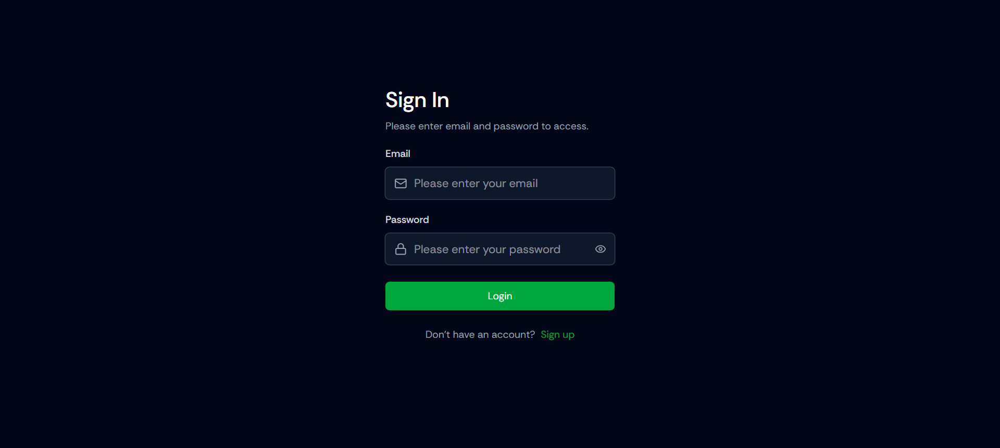
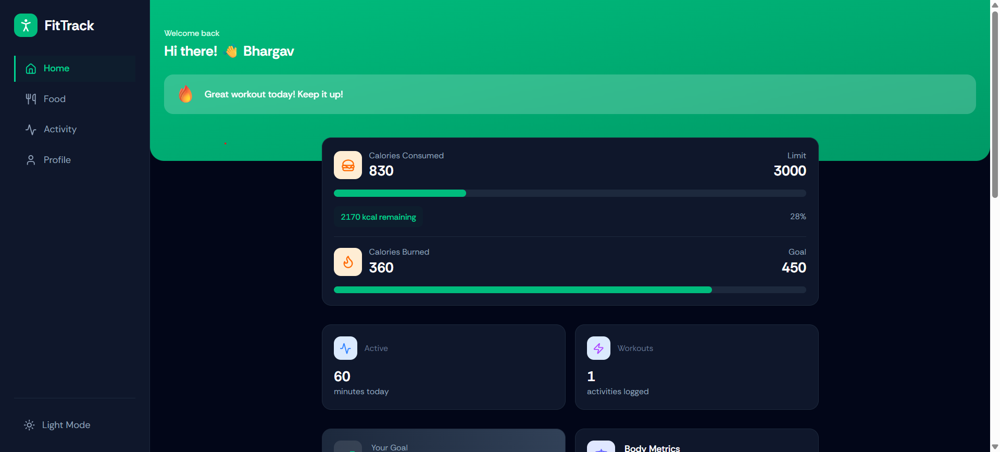
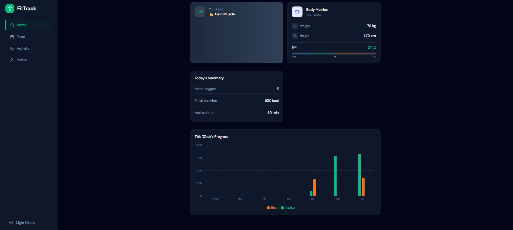
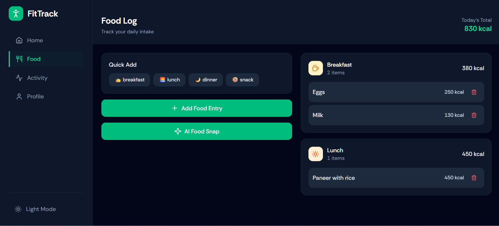
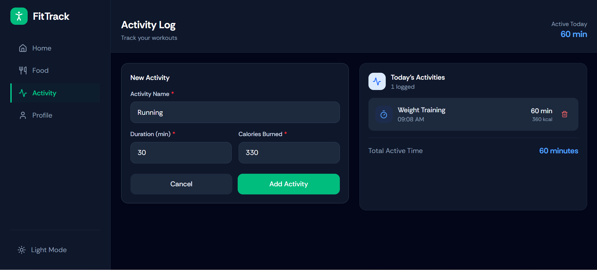
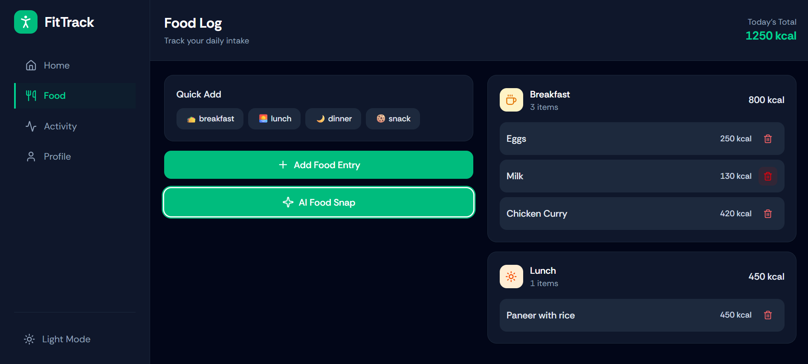
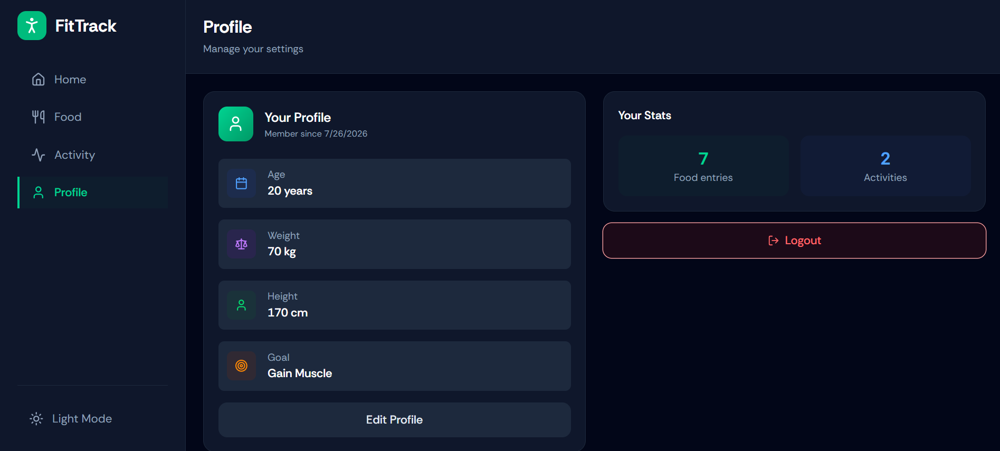

# 🏋️ AI Fitness Tracker


An AI-powered fitness tracking web application that helps users monitor their daily food intake, physical activities, and calorie consumption. It also uses **Google Gemini AI** to analyze food images and estimate calories.

---

## 📚 Table of Contents

- [Live Demo](#-live-demo)
- [Features](#-features)
- [Screenshots](#-screenshots)
- [Tech Stack](#-tech-stack)
- [Project Structure](#-project-structure)
- [Installation](#-installation)
- [Environment Variables](#-environment-variables)
- [AI Food Snap](#-ai-food-snap)
- [Deployment](#-deployment)
- [Future Improvements](#-future-improvements)
- [Author](#-author)
- [License](#-license)

---

## 🚀 Live Demo

**Frontend:**  
https://fitness-tracker-k8x3.vercel.app

**Backend API:**  
https://fitness-tracker-server-g1tq.onrender.com

---

## 📌 Features

- 🔐 User Authentication (Register & Login)
- 🍽️ Food Log Management
- 🏃 Activity Log Management
- 🤖 AI Food Recognition using Google Gemini AI
- 🔥 Automatic Calorie Estimation
- 📊 Daily Fitness Tracking
- ☁️ PostgreSQL Cloud Database
- 📱 Responsive UI
- ⚡ Fast Performance

---

## 🖼️ Screenshots

### Login



### Home



### Dashboard



### Food Log



### Activity Log



### AI Food Snap



### Profile



---

## 🛠️ Tech Stack

### Frontend

- React.js
- TypeScript
- Vite
- Tailwind CSS
- React Router
- Axios

### Backend

- Strapi CMS
- Node.js
- TypeScript

### Database

- PostgreSQL (Neon)

### AI

- Google Gemini API

### Deployment

- Vercel
- Render
- Neon PostgreSQL

---

## 📂 Project Structure

```text
Fitness_Tracker/
│
├── client/
│
├── server/
│
├── screenshots/
│
├── README.md
│
└── .gitignore
```

---

## ⚙️ Installation

### Prerequisites

- Node.js
- npm

Clone the repository:

```bash
git clone https://github.com/bhargavguthi/Fitness_Tracker.git
```

Go to the project folder:

```bash
cd Fitness_Tracker
```

### Run Frontend

```bash
cd client
npm install
npm run dev
```

### Run Backend

```bash
cd server
npm install
npm run develop
```

---

## 🔑 Environment Variables

Create a `.env` file inside the `server` folder.

```env
DATABASE_URL=your_database_url
JWT_SECRET=your_jwt_secret
ADMIN_JWT_SECRET=your_admin_jwt_secret
API_TOKEN_SALT=your_api_token_salt
APP_KEYS=your_app_keys
GEMINI_API_KEY=your_gemini_api_key
```

> Replace the placeholder values with your own credentials. Never commit your real API keys or secrets to GitHub.

---

## 🤖 AI Food Snap

1. Upload a food image.
2. Google Gemini AI analyzes the image.
3. Calories are estimated.
4. Save the result directly to your Food Log.

---

## 🚀 Deployment

| Service | Platform |
|---------|----------|
| Frontend | Vercel |
| Backend | Render |
| Database | Neon PostgreSQL |
| AI | Google Gemini API |

---

## 🎯 Future Improvements

- Nutrition Analysis
- Meal Planner
- Workout Recommendations
- Weekly Reports
- Goal Tracking
- Water Intake Tracking
- Dark Mode
- Push Notifications

---

## 🤝 Contributing

Contributions, issues, and feature requests are welcome.

---

## 👨‍💻 Author

**Guthi Srinivasa Bhargav**

GitHub: https://github.com/bhargavguthi

---

## ⭐ Support

If you found this project useful, consider giving it a ⭐ on GitHub.

---

## 📄 License

This project is created for learning and portfolio purposes.

